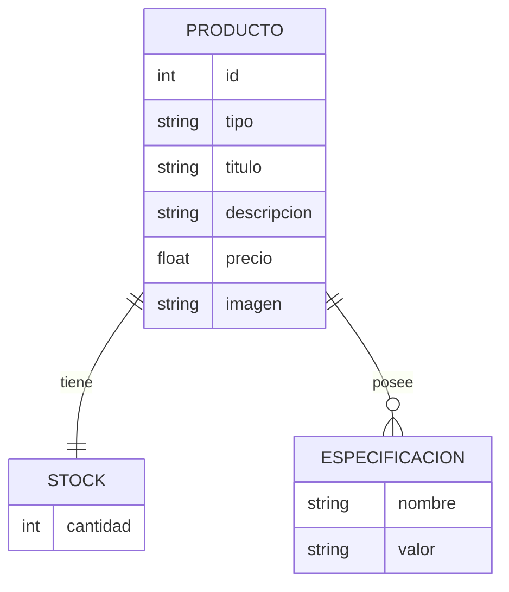

# Proyecto Ecommerce – React JS

## Introducción

Este proyecto consiste en una aplicación **Ecommerce desarrollada en React JS**, realizada como práctica final del **Curso de React JS en la plataforma CoderHouse**.

La aplicación representa la venta de productos de **Pesca**, permitiendo a los usuarios navegar por categorías, visualizar productos, consultar sus detalles y agregarlos a un carrito de compras. A medida que se seleccionan productos, se conforma un carrito que puede visualizarse desde el **NavBar** o desde la opción de **Finalizar compra**.

El objetivo principal del proyecto es aplicar y consolidar conceptos fundamentales de React JS como componentes, estados, contextos, hooks, ruteo y consumo de servicios externos.

---

## Alcance del Proyecto

El alcance funcional de la versión actual incluye:

- Visualización de productos organizados por **categorías**.
- Navegación entre categorías desde el **NavBar**.
- Visualización del **detalle de un producto**.
- Selección de cantidad de unidades a comprar.
- Agregado de productos al **carrito de compras**.
- Visualización del carrito con:
  - Productos agrupados por categoría.
  - Cantidad de unidades por producto.
  - Cálculo del **total del carrito**.
- Finalización de la compra mostrando un mensaje de **“pago en proceso”**.

> ⚠️ La funcionalidad de pago **no se encuentra implementada** en esta versión.

---

## Fuera de Alcance

Las siguientes funcionalidades no forman parte del desarrollo actual:

- Integración con pasarelas de pago.
- Persistencia de órdenes de compra.
- Gestión de usuarios o autenticación.

---

## Configuración General

### Base de Datos

El aplicativo utiliza **Firebase Firestore** para el almacenamiento y consulta de los productos.

La inicialización de la base de datos se realiza a partir de los siguientes archivos:

- **prod.js**: contiene una base inicial de productos.
- **upload.js**: script encargado de inicializar las colecciones en Firestore.

### Archivos de Conexión y Configuración

- **firestore.js**: configuración y datos de conexión a Firebase.
- **categorias.js**: configuración de las categorías disponibles en la aplicación.
- **TipoProducto.js**: definición de clasificaciones y tipos de productos.

---

## Clasificación de Productos

Los productos se encuentran organizados de la siguiente manera:

### Categorías

- **Reeles**
- **Cañas**
- **Accesorios**

### Tipos de Producto

Cada categoría contiene uno o más tipos que identifican el producto.

| Categoría   | Tipo       |
|------------|------------|
| Reeles     | reel       |
| Cañas      | caña       |
| Accesorios | plomadas  |
| Accesorios | anzuelos  |

La configuración de estas clasificaciones puede consultarse en el archivo **TipoProducto.js**.

---

## Estructura de un Producto

Cada producto está representado internamente por la siguiente estructura:

- **id**: número identificador único del producto.
- **stock**: cantidad disponible del producto.
  - Este dato podría provenir de un servicio externo, pero en este proyecto se maneja como parte del objeto producto.
- **tipo**: clasificación del producto (reel, caña, plomada, anzuelo).
- **titulo**: nombre del producto.
- **desc**: descripción ampliada del producto.
- **precio**: precio del producto.
- **imagen**: imagen asociada al producto.
- **especificaciones**: lista de propiedades para detallar características adicionales.

---

## Librerías Utilizadas

El proyecto fue desarrollado utilizando las siguientes tecnologías y librerías:

- **React JS**
- **react-bootstrap** `2.10.10`
- **firebase**
- **vite** `7.1.7`

---

## Instalación

Para ejecutar el proyecto en un entorno local, seguir los siguientes pasos:

1. Clonar el repositorio del proyecto:
   ```bash
   git clone <url-del-repositorio>
   ```

2. Acceder al directorio del proyecto:
   ```bash
   cd nombre-del-proyecto
   ```

3. Instalar las dependencias:
   ```bash
   npm install
   ```

4. Configurar las credenciales de Firebase en el archivo **firestore.js**.

5. Inicializar la base de productos en Firestore ejecutando el script correspondiente:
   ```bash
   node upload.js
   ```

6. Ejecutar el proyecto:
   ```bash
   npm run dev
   ```

---

## Mejoras y Próximas Iteraciones

El presente proyecto cubre principalmente los aspectos funcionales relacionados con la visualización y compra de productos utilizando React JS.

Las siguientes mejoras se consideran para una próxima iteración:

- Mejora de la **interfaz de usuario (UI/UX)**.
- Implementación de **paginación** en la visualización de productos.
- Incorporación de una **búsqueda de productos**.
- Integración con una **pasarela de pagos**.
- Persistencia de órdenes de compra.

---

## Observaciones Finales

Este proyecto tiene un enfoque didáctico y está orientado a demostrar el uso de las principales funcionalidades de React JS en un contexto realista de Ecommerce.

No se priorizó el diseño visual avanzado, sino la correcta implementación de la lógica de negocio, la estructura de componentes y la gestión del estado de la aplicación.

---

## Diagrama de Entidades (DER)

A continuación se presenta un **Diagrama Entidad-Relación (DER)** simplificado que representa el modelo de datos utilizado en el proyecto.

El diseño está orientado a un enfoque conceptual, alineado con la estructura de los objetos manejados en la aplicación y su persistencia en Firestore.

### Entidades y Relaciones

- **Producto** es la entidad principal.
- Cada **Producto** posee:
  - Un **Stock** asociado (relación 1 a 1).
  - Un conjunto de **Especificaciones** asociadas (relación 1 a 1).

### Diagrama DER (Representación lógica)



### Descripción de Entidades

**Producto**
- Representa el artículo disponible para la venta.
- Contiene la información principal que se visualiza en la aplicación.

**Stock**
- Define la cantidad disponible de un producto.
- Se modela como una entidad independiente para permitir una futura extensión (por ejemplo, control de stock por sucursal o integración con servicios externos).

**Especificación**
- Representa un conjunto de propiedades descriptivas del producto.
- Permite agregar características variables sin modificar la estructura principal del producto.

> 📌 Nota: En la implementación actual con Firestore, estas entidades pueden encontrarse embebidas dentro del documento **Producto**, manteniendo igualmente la relación lógica aquí descripta.

---

**Autor:** Proyecto académico – Curso React JS (CoderHouse)

