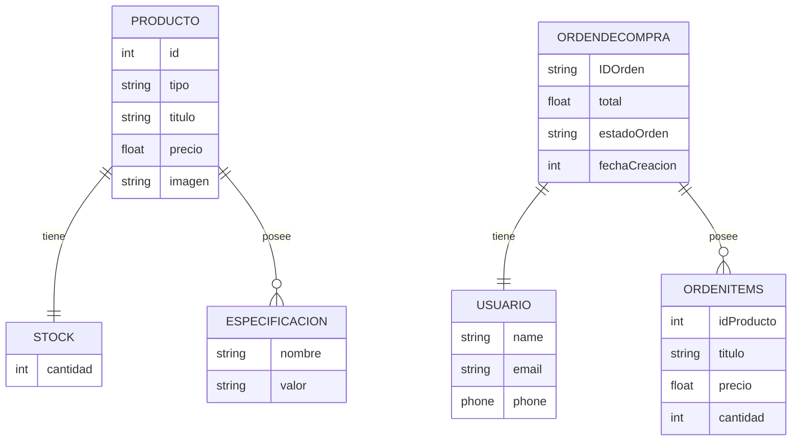
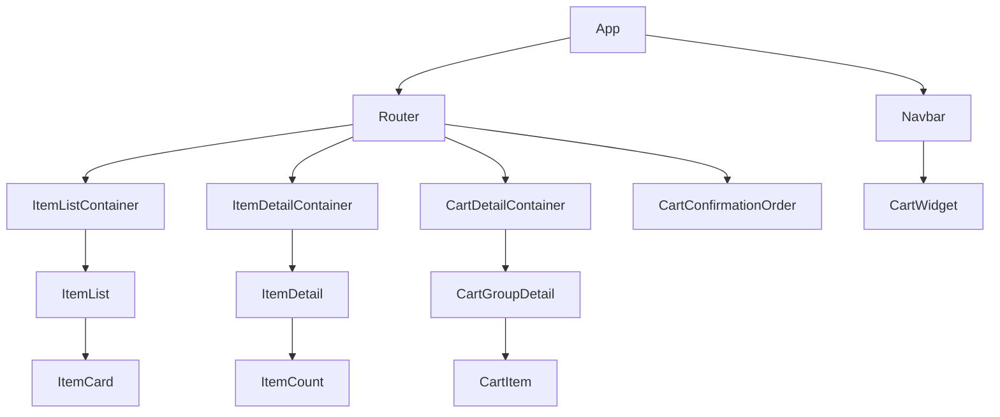
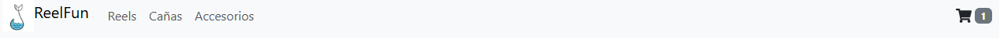
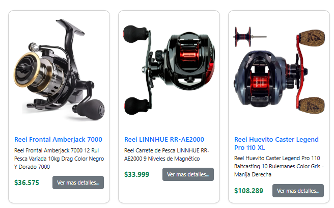
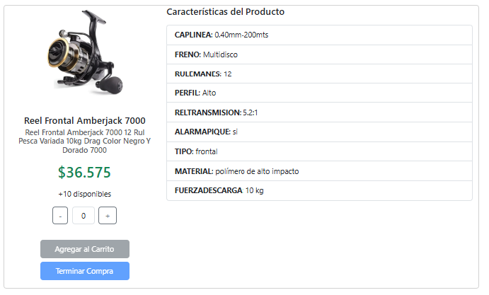
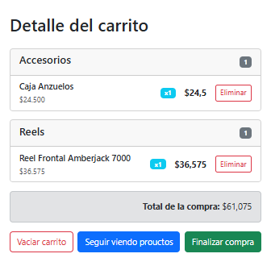
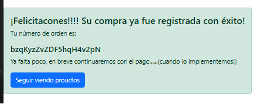
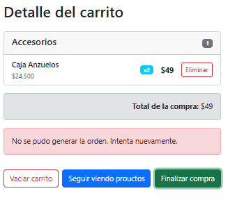

# Proyecto Ecommerce – React JS

Nombre del Proyecto: ReelFun

## Tabla de Contenidos

- [Introducción](#introducción)
- [Alcance del Proyecto](#alcance-del-proyecto)
- [Fuera de Alcance](#fuera-de-alcance)
- [Descripción Dominio de la Aplicación](#descripción-dominio-de-la-aplicación)
  - [Clasificación de Productos](#clasificación-de-productos)
  - [Categorías](#categorías)
  - [Tipos de Producto por Categoría](#tipos-de-producto-por-categoría)
  - [Estructura de un Producto](#estructura-de-un-producto)
  - [Especificaciones de un Producto](#especificaciones-de-un-producto)
  - [Stock de un Producto](#stock-de-un-producto)
  - [Usuario](#usuario)
- [Diagrama de Entidades (DER)](#diagrama-de-entidades-der)
- [Diagrama simplificado del árbol de componentes](#diagrama-simplificado-del-%C3%A1rbol-de-componentes)
- [Flujo de Navegación y Uso de la Aplicación](#flujo-de-navegación-y-uso-de-la-aplicación)
  - [Navegación Principal–NavBar](#navegación-principal–navbar)     
  - [Detalle de Producto](#detalle-de-producto)
  - [Visualización del Carrito y Confirmación de Compra](#visualización-del-carrito-y-confirmación-de-compra)
  - [Visualización de la confirmación exitosa del carrito](#visualización-de-la-confirmación-exitosa-del-carrito)
- [Dependencias del Proyecto](#dependencias-del-proyecto) 
- [Instalación](#instalación)
  - [Configuración General – Base de Datos](#configuración-general--base-de-datos)
  - [Creación del Proyecto en Firebase / Firestore](#creación-del-proyecto-en-firebase--firestore)
  - [Inicialización de Firestore Database](#inicialización-de-firestore-database)
- [Archivos Configuración](#archivos-configuración)
- [Mejoras y Próximas Iteraciones](#mejoras-y-próximas-iteraciones)
- [Resumen de Aplicaciones Técnicas](#resumen-de-aplicaciones-técnicas)

---

## Introducción

Proyecto con enfoque didáctico orientado a la aplicación práctica de React JS y su integración con servicios externos como Firebase. 
En este contexto se implementa un **Ecommerce con React JS**, realizada como práctica final del **Curso de React JS en la plataforma CoderHouse**.

La aplicación representa la venta de productos de **Pesca**, permitiendo a los usuarios navegar por categorías, visualizar productos, consultar sus detalles y agregarlos a un carrito de compras. A medida que se seleccionan productos, se conforma un carrito que puede visualizarse desde el **NavBar** o desde la opción de **Terminar compra** desde el detalle de un Articulo.

El objetivo principal del proyecto es aplicar conceptos vistos de React JS como componentes, estados, contextos, hooks, ruteo y consumo de servicios externos.

---

## Alcance del Proyecto

El alcance funcional de la versión actual incluye:

- Visualización de productos organizados por **categorías**.
- Navegación entre categorías desde el **NavBar**.
- Visualización del **detalle de un producto**.
- Selección de cantidad de unidades a comprar.
- Agregado de productos al **carrito de compras**.
- Visualización del carrito con:
  - Productos agrupados por categoría.
  - Cantidad de unidades por producto.
  - Cálculo del **total del carrito**.
- Finalización de la compra, si se procesa correctamente el carrito se generará una Orden de Compra con los datos del Usuario(*) e items del carrito y se informará el numero de orden generado.

> ⚠️ La funcionalidad de pago **no se encuentra implementada** en esta versión.
> (*) Los datos del usuario son genericos y se inicializan en un contexto el cual puede ser utilizado en futuras integraciones.

---

## Fuera de Alcance

Las siguientes funcionalidades no forman parte del desarrollo actual:

- Integración con servicios de pago. 
- Gestion del stock por compras realizadas.
- Gestión de usuarios o autenticación.

---

## Descripción Dominio de la Aplicación

### Clasificación de Productos

### Categorías

Las categorias se utilizan para agrupar un conjunto de tipos de productos, estos tipos estan asociados a cada producto.

- **Reeles**
- **Cañas**
- **Accesorios**

### Tipos de Producto por Categoría

| Tipo     | Reeles | Cañas | Accesorios |
| -------- |:------:|:-----:|:----------:|
| reel     | x      |       |            |
| caña     |        | x     |            |
| plomadas |        |       | x          |
| anzuelos |        |       | x          |

La configuración de estas clasificaciones puede consultar en la seccion 
[Archivos Configuración](#Archivos-Configuración). Esta configuracion es dinamica y se utiliza para la busqueda de los productos y visualizacion de las clasificaciones en el NAVBAR.

---

## Estructura de un Producto

- **id**: identificador único del producto.
- **tipo**: los produtos estan tipificados segun algunos de los siguientes valores: [reel|caña|plomada|anzuelo]
- **titulo**: nombre del producto.
- **desc**: descripción ampliada.
- **precio**: precio del producto.
- **imagen**: imagen asociada.

## Especificaciones de un Producto

Cada producto tiene un lista de caracteriscticas, esta informacion se gestiona en otra coleccion y referenciada por el ID del producto.

- **especificaciones**: lista dinámica de pares nombre–valor.

> Lo recomendable es que esta coleccion este referencia por el id del documento del producto y no por un atributo. En este caso (como no tenemos un ABM para los datos) solo a modo didactico lo relacionamos al id del producto.

## Stock de un Producto

Cada producto tiene un stock, gestionado en la coleccion de Stock referenciado por el id del producto.

> Aplica la misma apreciación del id que las Especificaciones.

## Usuario

Identifica el usuario loggeado al sistema, se implementa un Context Api para manejar un usuario genérico. De esta manera se permite simular el flujo completo de una orden sin necesidad de un sistema de autenticación, dejando el diseño preparado para futuras integraciones.

---

## Diagrama de Entidades (DER)



---

## Diagrama simplificado del árbol de componentes

A continuación se presenta un **árbol de componentes** de la aplicación React, con el objetivo de ilustrar la organización general y la responsabilidad de cada componente.



### Descripción General

- **App**: componente raíz de la aplicación.
- **Navbar**: navegación principal y acceso al carrito.
- **Router**: manejo de rutas y vistas.
- **ItemListContainer**: carga y visualización de productos por categoría.
- **ItemDetailContainer**: visualización del detalle de un producto. Incluye opciones para agregar unidades al carrito y finalizar compra.
- **CartDetailContainer**: Gestion, Visualización y Confirmación del carrito.
- **CartConfirmationOrder**: Visualizacion del nro.de orden generado al confirmar el carrito.
- **CartWidget**: acceso rápido al carrito desde el NavBar.

---


## Flujo de Navegación y Uso de la Aplicación

Breve detalle visual del flujo principal de uso del aplicativo, desde la navegación inicial hasta la confirmación de la compra en el carrito.

### Navegación Principal – NavBar

El NavBar es el punto central de navegación de la aplicación. Permite al usuario acceder rápidamente a las categorías de productos y visualizar el estado del carrito.

Funcionalidades principales:

* Acceso a las categorías de productos (Reeles, Cañas, Accesorios).

* Visualización del CartWidget con la cantidad de ítems agregados. 
  
  * También responde como acceso rápido al carrito para Finalizar la compra.
  * Solo es visible si existe al menos  un producto en el carrito.
  * Se actualiza dinámicamente al agregar o eliminar productos desde la visualización de productos.

* Accediendo al Brand ReelFun se acceden a la lista completa de Productos sin filtro sobre la categoría.



### Detalle de Producto

Desde el listado de productos, el usuario puede acceder al detalle de un producto, desde el Boton "Ver mas detalles.." donde se muestra la información completa del artículo seleccionado.



Desde este componente se visualiza la siguiente información: 

* Imagen del producto.
* Título y descripción.
* Precio.
* Especificaciones dinámicas.
* Unidades disponibles
* Selector de cantidad para agregar a la compra.
* Acciónes para Agregar al carrito o Finalizar compra.



### Visualización del Carrito y Confirmación de Compra

El carrito de compras permite revisar los productos seleccionados antes de finalizar la compra.

Funcionalidades principales:

* Visualización de productos agrupados por categoría. 
* Eliminación de ítems o eliminar carrito completo.
* Confirmación del carrito.
* Seguir comprando



### Visualización de la confirmación exitosa del carrito.

Al finalizar la compra se conforma y genera en la base una Orden de Compra con los datos del usuario y el carrito. Si esta operación es exitosa se informa al usuario el nro.de orden generada.



> En caso que la confirmación de la orden falle, se emitirá un Alerta informando la situación:
> 


---

## Dependencias del Proyecto

El proyecto utiliza las siguientes dependencias principales, organizadas por responsabilidad dentro de la aplicación:

- Core de React

| Dependencia | Versión | Descripción                                                                              |
| ----------- | ------- | ---------------------------------------------------------------------------------------- |
| react       | ^19.1.1 | Librería principal para la construcción de interfaces de usuario basadas en componentes. |
| react-dom   | ^19.1.1 | Permite renderizar la aplicación React en el DOM del navegador.                          |

- Navegación y Ruteo

| Dependencia      | Versión | Descripción                                                 |
| ---------------- | ------- | ----------------------------------------------------------- |
| react-router-dom | ^7.9.6  | Manejo de rutas y navegación entre vistas de la aplicación. |

- UI y Estilos

| Dependencia     | Versión  | Descripción                                                                                         |
| --------------- | -------- | --------------------------------------------------------------------------------------------------- |
| bootstrap       | ^5.3.8   | Framework CSS utilizado como base de estilos.                                                       |
| react-bootstrap | ^2.10.10 | Componentes Bootstrap adaptados a React, utilizados para acelerar el desarrollo de los componentes. |
| react-icons     | ^5.5.0   | Biblioteca de íconos SVG utilizada principalmente en el NavBar y el carrito.                        |

- Persistencia y Servicios Externos

| Dependencia | Versión | Descripción                                                                              |
| ----------- | ------- | ---------------------------------------------------------------------------------------- |
| firebase    | ^12.7.0 | SDK de Firebase utilizado para la conexión con Firestore Database y la gestión de datos. |

---


## Instalación

1. Clonar el repositorio:
   
   ```bash
   https://github.com/cdmaidana/ReelFun.git
   ```

2. Ingresar al proyecto:
   
   ```bash
   cd ReelFun
   ```

3. Instalar dependencias:
   
   ```bash
   npm install
   ```

### Configuración General – Base de Datos

El proyecto utiliza **Firebase Firestore** como base de datos NoSQL para almacenar la información de los productos.

Esta configuración es requerida para los pasos **4 y 5** del proceso de instalación.

### Creación del Proyecto en Firebase / Firestore

4. Acceder a https://console.firebase.google.com/ y crear un nuevo proyecto.

5. Agregar una aplicación **Web** y obtener la configuración del **SDK de JavaScript (modular)** desde la sección **Configuración del proyecto → General**.

6. Copiar la configuración del SDK y reemplazar los valores en el archivo:

```text
src/services/firebase/conf/firebase-conf.js
```

### Inicialización de Firestore Database

7. Habilitar **Firestore Database** desde la consola de Firebase (modo prueba recomendado para uso académico).

8. Ejecutar desde la raíz del proyecto:
   
    Se define un conjunto de datos para la configuración inicial de las colecciones de Productos, Stock y Especificaciones. Para mas detalles ver el archivo .\scripts\firebase\data.js 

```bash
node ./scripts/firebase/uploadDataInFirestore.js
```

> ⚠️  Este script inicializa las siguientes colecciones:
> 
> - **Productos**
> - **Especificaciones**
> - **Stock**

9. Ejecutar el proyecto:
   
    Inicializadas las colecciones estamos en condiciones de ejecutar nuestro proyecto.

```bash
npm run dev
```

---

## Archivos Configuración

- **.\src\services\firebase\conf\firebase-conf.js**: conexión a Firebase.
- **.\src\services\productos\ClasificacionProducto.js**: configuracion de los Tipos y Categorias de los productos .
- **scripts/firebase/data.js**: estructura de datos para inicializar las coleeciones de productos, especificaciones y stock.

---

## Mejoras y Próximas Iteraciones

- Mejora de UI/UX.
- Paginación de productos.
- Integración con pagos.

---

## Resumen de Aplicaciones Técnicas:

Teniendo en cuenta el alcance y objetivos del curso, se implemento el proyecto teniendo en cuenta los siguientes conceptos:

### React JS

- React con componentes funcionales  y hooks para favorecer un código más simple y moderno.
- Se priorizó la separación de responsabilidades mediante componentes reutilizables.

### Gestión de Estado

- El estado global del carrito se maneja mediante **Context API**, evitando prop drilling. Permite encapsular la logica y manipulacion del carrito en un solo servicio. Ver archivo  src\providers\CartContextProvider.jsx 

### Firebase Firestore

- permite una rápida integración con aplicaciones frontend y su modelo NoSQL orientado a documentos.  Esto agiliza el desarrollo inicial de prototipos de aplicaciones.

### Diseño del Modelo de Datos

- Se definió una relación lógica 1:1 entre Producto y Stock para facilitar futuras extensiones, por ejemplo consulta a un servicio externo para obtencion del stock.
- La relación Producto–Especificaciones se modeló como 1:N para adaptarse a productos con atributos variables.

### Estilos y UI

- Se utilizó **react-bootstrap** para acelerar el desarrollo visual y mantener consistencia en los componentes.
- El foco principal estuvo en la **funcionalidad** más que en el diseño visual avanzado.
- En otra iteracion, se deben corregir distintos aspectos visuales no considerados prioritarios para esta entrega didactica.

### Bundler y Herramientas

- El curso propone **Vite** por su rapidez en el entorno de desarrollo y configuración simplificada.

---

**Autor:** Maidana César – Curso React JS (CoderHouse)
