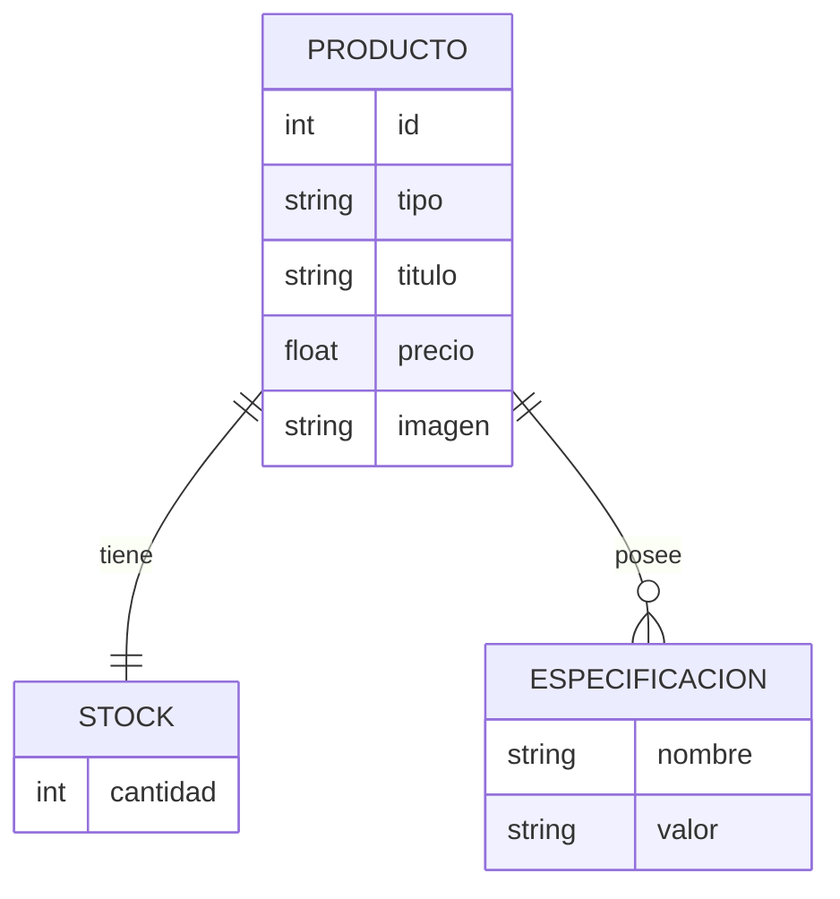
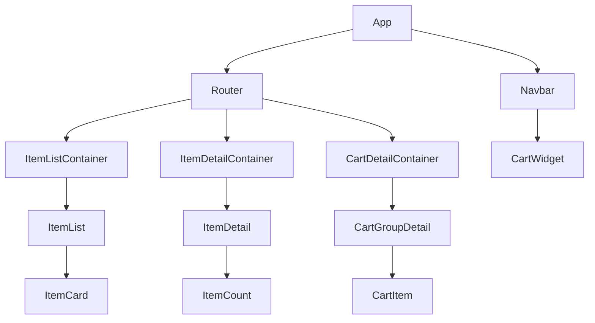

# Proyecto Ecommerce – React JS

## Índice

- [Introducción](#introducción)
- [Alcance del Proyecto](#alcance-del-proyecto)
- [Fuera de Alcance](#fuera-de-alcance)
- [Clasificación de Productos](#clasificación-de-productos)
  - [Categorías](#categorías)
  - [Tipos de Producto](#tipos-de-producto)
- [Estructura de un Producto](#estructura-de-un-producto)
- [Diagrama de Entidades (DER)](#diagrama-de-entidades-der)
- [Librerías Utilizadas](#librerías-utilizadas)
- [Instalación](#instalación)
  - [Configuración General – Base de Datos](#configuración-general--base-de-datos)
  - [Creación del Proyecto en Firebase / Firestore](#creación-del-proyecto-en-firebase--firestore)
  - [Inicialización de Firestore Database](#inicialización-de-firestore-database)
- [Archivos de Conexión y Configuración](#archivos-de-conexión-y-configuración)
- [Mejoras y Próximas Iteraciones](#mejoras-y-próximas-iteraciones) 

---

## Introducción

Proyecto con enfoque didáctico orientado a la aplicación práctica de React JS y su integración con servicios externos como Firebase. 
En este contexto se implementa un **Ecommerce con React JS**, realizada como práctica final del **Curso de React JS en la plataforma CoderHouse**.

La aplicación representa la venta de productos de **Pesca**, permitiendo a los usuarios navegar por categorías, visualizar productos, consultar sus detalles y agregarlos a un carrito de compras. A medida que se seleccionan productos, se conforma un carrito que puede visualizarse desde el **NavBar** o desde la opción de **Finalizar compra**.

El objetivo principal del proyecto es aplicar y consolidar conceptos fundamentales de React JS como componentes, estados, contextos, hooks, ruteo y consumo de servicios externos.

---

## Alcance del Proyecto

El alcance funcional de la versión actual incluye:

- Visualización de productos organizados por **categorías**.
- Navegación entre categorías desde el **NavBar**.
- Visualización del **detalle de un producto**.
- Selección de cantidad de unidades a comprar.
- Agregado de productos al **carrito de compras**.
- Visualización del carrito con:
  - Productos agrupados por categoría.
  - Cantidad de unidades por producto.
  - Cálculo del **total del carrito**.
- Finalización de la compra mostrando un mensaje de **“pago en proceso”**.

> ⚠️ La funcionalidad de pago **no se encuentra implementada** en esta versión.

---

## Fuera de Alcance

Las siguientes funcionalidades no forman parte del desarrollo actual:

- Integración con servicios de pago.
- Persistencia del carrito u órden de compra.
- Gestion del stock por compras realizadas.
- Gestión de usuarios o autenticación.

---

## Clasificación de Productos

### Categorías

- **Reeles**
- **Cañas**
- **Accesorios**

### Tipos de Producto por Categoría

| Tipo     | Reeles | Cañas | Accesorios |
| -------- |:------:|:-----:|:----------:|
| reel     | x      |       |            |
| caña     |        | x     |            |
| plomadas |        |       | x          |
| anzuelos |        |       | x          |

La configuración de estas clasificaciones puede consultarse en el archivo **TipoProducto.js**.

---

## Estructura de un Producto

- **id**: identificador único del producto.
- **stock**: cantidad disponible.
- **tipo**: reel, caña, plomada o anzuelo.
- **titulo**: nombre del producto.
- **desc**: descripción ampliada.
- **precio**: precio del producto.
- **imagen**: imagen asociada.
- **especificaciones**: lista dinámica de pares nombre–valor.

---

## Diagrama de Entidades (DER)



---

## Librerías Utilizadas

- **React JS**
- **react-bootstrap** `2.10.10`
- **firebase**
- **vite** `7.1.7`

---

## Instalación

1. Clonar el repositorio:
   
   ```bash
   https://github.com/cdmaidana/ReelFun.git
   ```

2. Ingresar al proyecto:
   
   ```bash
   cd ReelFun
   ```

3. Instalar dependencias:
   
   ```bash
   npm install
   ```

### Configuración General – Base de Datos

El proyecto utiliza **Firebase Firestore** como base de datos NoSQL para almacenar la información de los productos.

Esta configuración es requerida para los pasos **4 y 5** del proceso de instalación.

### Creación del Proyecto en Firebase / Firestore

4. Acceder a https://console.firebase.google.com/ y crear un nuevo proyecto.

5. Agregar una aplicación **Web** y obtener la configuración del **SDK de JavaScript (modular)** desde la sección **Configuración del proyecto → General**.

6. Copiar la configuración del SDK y reemplazar los valores en el archivo:

```text
src/services/firebase/conf/firebase-conf.js
```

### Inicialización de Firestore Database

7. Habilitar **Firestore Database** desde la consola de Firebase (modo prueba recomendado para uso académico).

8. Ejecutar desde la raíz del proyecto:

```bash
node ./scripts/firebase/uploadDataInFirestore.js
```

> ⚠️  Este script inicializa las siguientes colecciones:
> 
> - **Productos**
> - **Especificaciones**
> - **Stock**

9. Ejecutar el proyecto:

```bash
npm run dev
```

---

## Archivos Configuración

- **firestore.js**: conexión a Firebase.
- **categorias.js**: configuracion de las Categorias de los productos .
- **scripts/firebase/data.js**: estructura de datos para inicializar las coleeciones de productos, especificaciones y stock.
- **TipoProducto.js**: definición de tipos y clasificaciones.

---

## Mejoras y Próximas Iteraciones

- Mejora de UI/UX.
- Paginación de productos.
- Integración con pagos.
- Persistencia de órdenes.

---

## Component Tree Diagram (React)

A continuación se presenta un **diagrama simplificado del árbol de componentes** de la aplicación React, con el objetivo de ilustrar la organización general y la responsabilidad de cada componente.



### Descripción General

- **App**: componente raíz de la aplicación.
- **Navbar**: navegación principal y acceso al carrito.
- **Router**: manejo de rutas y vistas.
- **ItemListContainer**: carga y visualización de productos por categoría.
- **ItemDetailContainer**: visualización del detalle de un producto.
- **CartDetailContainer**: gestión y visualización del carrito.
- **CartWidget**: acceso rápido al carrito desde el NavBar.

---

## Resumen de Aplicaciones Técnicas:

Teniendo en cuenta el alcance y objetivos del curso, se implemento el proyecto teniendo en cuenta los siguientes conceptos:

### React JS

- React con componentes funcionales  y hooks para favorecer un código más simple y moderno.
- Se priorizó la separación de responsabilidades mediante componentes reutilizables.

### Gestión de Estado

- El estado global del carrito se maneja mediante **Context API**, evitando prop drilling. Permite encapsular la logica y manipulacion del carrito en un solo servicio. Ver archivo  src\providers\CartContextProvider.jsx 

### Firebase Firestore

- permite una rápida integración con aplicaciones frontend y su modelo NoSQL orientado a documentos.  Esto agiliza el desarrollo inicial de prototipos de aplicaciones.

### Diseño del Modelo de Datos

- Se definió una relación lógica 1:1 entre Producto y Stock para facilitar futuras extensiones, por ejemplo consulta a un servicio externo para obtencion del stock.
- La relación Producto–Especificaciones se modeló como 1:N para adaptarse a productos con atributos variables.

### Estilos y UI

- Se utilizó **react-bootstrap** para acelerar el desarrollo visual y mantener consistencia en los componentes.
- El foco principal estuvo en la **funcionalidad** más que en el diseño visual avanzado.
- En otra iteracion, se deben corregir distintos aspectos visuales no considerados prioritarios para esta entrega didactica.

### Bundler y Herramientas

- El curso propone **Vite** por su rapidez en el entorno de desarrollo y configuración simplificada.

---

---

**Autor:** Maidana César – Curso React JS (CoderHouse)
